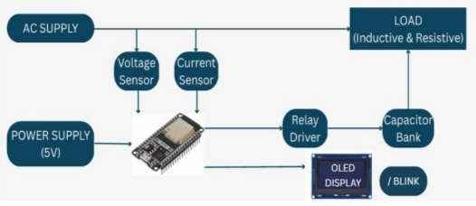
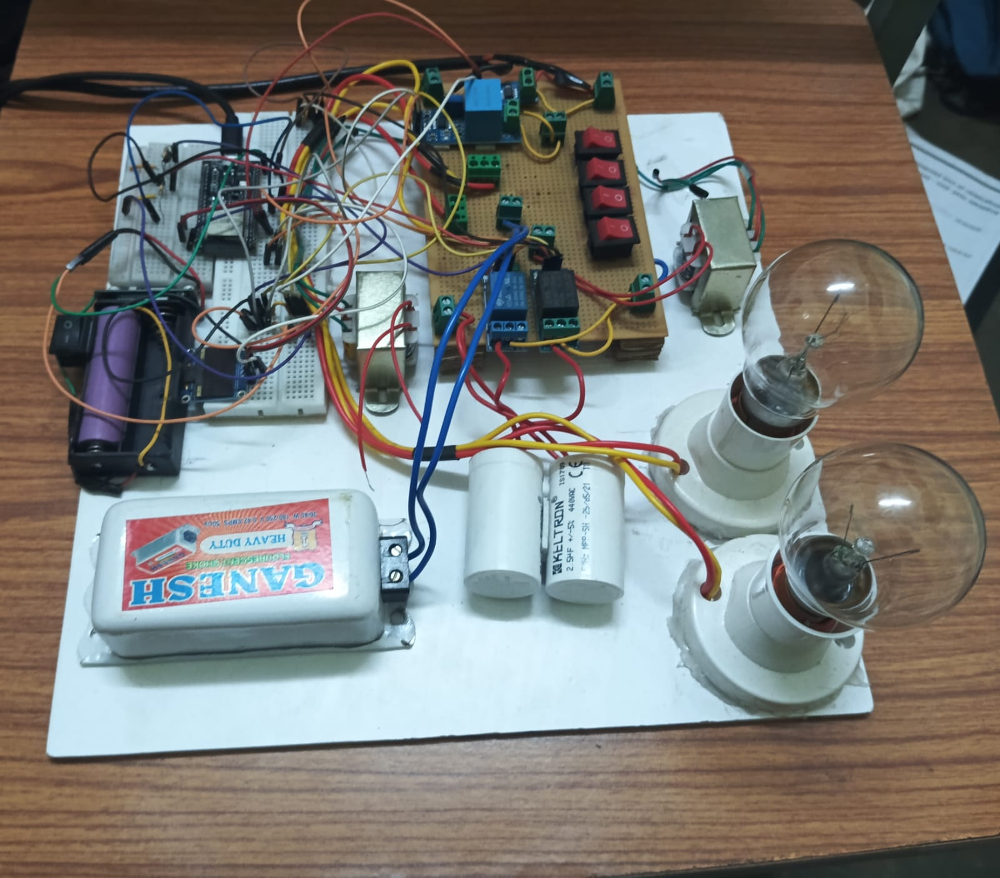
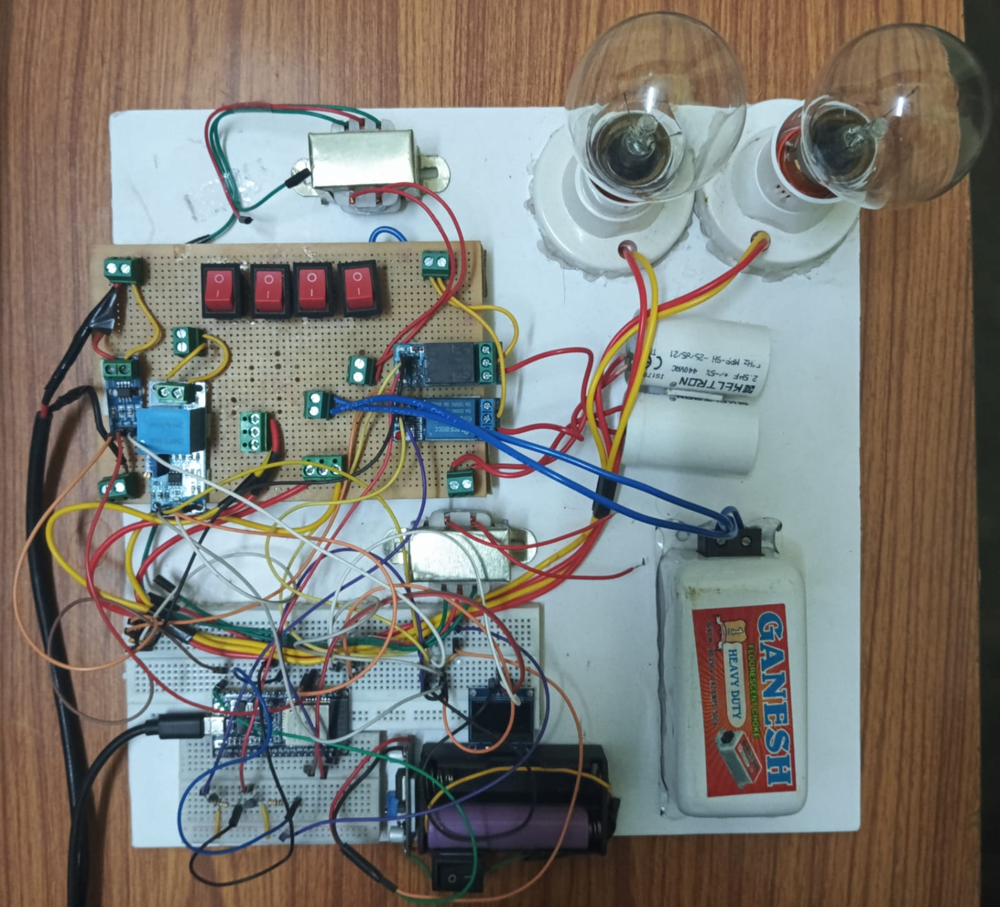
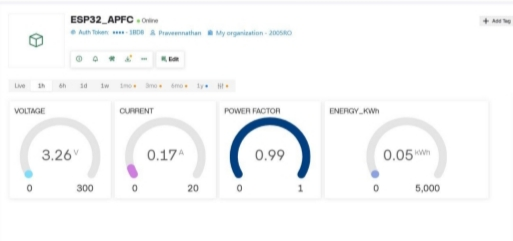
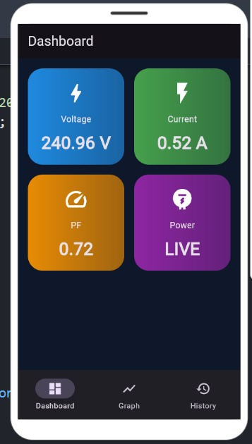
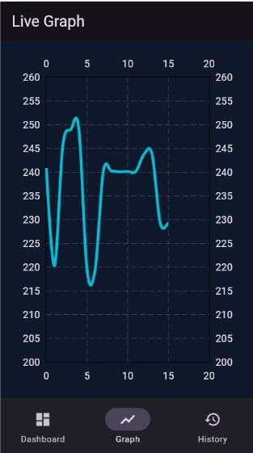
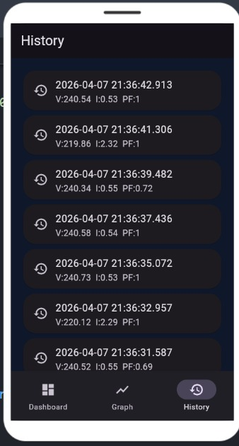

<div align="center">

# ⚡ Automatic Power Factor Correction (APFC) System

### Smart IoT-Based Power Factor Monitoring and Automatic Correction using ESP32

📱 Real-Time Monitoring • 📈 Live Analytics • ☁️ IoT Integration • ⚡ Automatic PF Correction

</div>

---

## 📖 Overview

The **Automatic Power Factor Correction (APFC) System** is an IoT-enabled electrical monitoring and control system designed to improve power factor automatically by switching capacitor banks based on load conditions.

The system continuously measures voltage, current, and power factor using sensors connected to an ESP32 controller. Real-time data is displayed locally on an OLED display and remotely through the Blynk mobile application.

---

## 🎯 Objectives

✅ Improve Power Factor Automatically

✅ Reduce Reactive Power Consumption

✅ Increase Electrical System Efficiency

✅ Enable Remote Monitoring Through IoT

✅ Visualize Real-Time Electrical Parameters

---

## 🏗️ System Architecture

<p align="center">
  
</p>

---

## 🔧 Components Used

| 🔹 Component | 📌 Purpose |
|------------|------------|
| 🖥️ ESP32 Dev Board | Main Controller |
| ⚡ ZMPT101B Voltage Sensor | Voltage Measurement |
| 🔌 ACS712 Current Sensor | Current Measurement |
| 🔄 2-Channel Relay Module | Capacitor Switching |
| 🔋 Capacitor Bank | Power Factor Correction |
| 📟 OLED SH1106 Display | Local Display of Parameters |
| 📱 Blynk IoT Application | Remote Monitoring |
| 🔋 5V Power Supply | Powers ESP32 and Sensors |
| 💡 Resistive Load | Testing Load |
| 🌀 Inductive Load | Creates Lagging Power Factor |

---

## ⚙️ Working Principle

1. ⚡ Voltage sensor measures AC supply voltage.
2. 🔌 Current sensor measures load current.
3. 🖥️ ESP32 processes sensor readings.
4. 📈 Power factor is calculated continuously.
5. 🔄 Relay module switches capacitor banks automatically.
6. ⚡ Power factor is improved and maintained.
7. 📱 Data is transmitted to the Blynk Cloud.
8. 📊 Users can monitor live readings through the mobile application.

---

## ✨ Key Features

### ⚡ Electrical Monitoring

- Real-Time Voltage Measurement
- Real-Time Current Measurement
- Power Factor Calculation
- Load Analysis

### 🔄 Automatic Control

- Automatic Capacitor Switching
- Relay-Based Control
- Improved Power Factor

### 📱 Mobile Application

- Secure Login System
- Live Dashboard
- Historical Data Storage
- Graphical Analysis

### ☁️ IoT Connectivity

- Blynk Cloud Integration
- Remote Access
- Real-Time Data Updates

---

## 🛠️ Hardware Implementation

### 🔌 APFC Prototype

<p align="center">
  
</p>

---

### ⚙️ Complete Hardware Setup

<p align="center">
  
</p>

---

## ☁️ Blynk IoT Dashboard

The APFC system communicates with the Blynk IoT platform for remote monitoring and data visualization.

<p align="center">
  
</p>

### Features

📱 Remote Monitoring

⚡ Live Voltage Display

🔌 Live Current Display

📈 Power Factor Monitoring

☁️ Cloud Connectivity

🕒 Data Logging

🌐 Anywhere Access

---

## 📱 Mobile Application

### 🔐 Login Screen

<p align="center">
  
</p>

Secure authentication for accessing the APFC monitoring system.

---

### 📊 Dashboard

<p align="center">
  
</p>

The dashboard displays:

⚡ Voltage

🔌 Current

📈 Power Factor

🟢 System Status

---

### 📈 Live Graph

<p align="center">
  
</p>

Real-time visualization of system parameters.

---

### 🕒 History Screen

<p align="center">
  
</p>

Stores historical readings with timestamps for performance analysis.

---

## 📊 Parameters Monitored

| 📈 Parameter | Description |
|-------------|-------------|
| ⚡ Voltage | Supply Voltage |
| 🔌 Current | Load Current |
| 📈 Power Factor | PF Value |
| 🟢 Status | System Condition |
| 🕒 History | Stored Records |
| 📊 Graph | Live Trends |

---

## 🚀 Advantages

- ⚡ Improved Power Factor
- 💰 Reduced Electricity Penalties
- 🔋 Increased Energy Efficiency
- 📉 Reduced Reactive Power
- 🤖 Automatic Operation
- 📱 Remote Monitoring
- ☁️ IoT Enabled
- 📊 Real-Time Analytics

---

## 🔮 Future Enhancements

- ☁️ Cloud Database Integration
- 🤖 AI-Based Load Prediction
- ⚡ Three-Phase APFC System
- 🌐 Smart Grid Integration
- 📈 Advanced Energy Analytics
- 📱 Enhanced Mobile Dashboard

---

## 📂 Repository Structure

```text
Automatic-Power-Factor-Correction
│
├── README.md
│
├── Images
    ├── block_diagram.jpg
    ├── apfc_circuit_1.jpg
    ├── apfc_circuit_2.jpg
    ├── blynk_app.jpg
    ├── login_screen.jpg
    ├── dashboard_screen.jpg
    ├── history_screen.jpg
    └── live_graph_screen.jpg

```

---

## 📚 Applications

🏭 Industrial Power Systems

🏢 Commercial Buildings

⚡ Power Distribution Networks

🏫 Educational & Research Projects

🌐 IoT-Based Energy Monitoring Systems

---

## 👥 Team Members

This project was successfully developed through the collaborative efforts of:

- 👩‍💻 **Monikka R**
- 👨‍💻 **Moses Anand L**
- 👩‍💻 **Nandhini V**
- 👨‍💻 **Praveennathan J**
- 👨‍💻 **Badri R**

We sincerely thank all team members for their dedication, teamwork, and valuable contributions throughout the development of this project.

<div align="center">

★If you found this project useful, consider giving it a Star!

</div>
